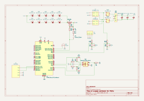

# UVExpose

UVExpose is a portable embedded UV exposure controller built on STM32F103C6.
The device is designed for precise timed UV illumination with safety protection, battery operation, and a structured modular firmware architecture suitable for long-term extension.

## 📋 Table of Contents

- [UVExpose](#uvexpose)
  - [📋 Table of Contents](#-table-of-contents)
  - [✨ Features](#-features)
    - [Core functionality](#core-functionality)
    - [Safety system](#safety-system)
    - [Power management](#power-management)
    - [User interface](#user-interface)
    - [Audio feedback](#audio-feedback)
  - [🧠 Firmware Architecture](#-firmware-architecture)
    - [Application Layer](#application-layer)
    - [Service Layer](#service-layer)
    - [Safety Layer](#safety-layer)
    - [UI Layer](#ui-layer)
    - [Drivers Layer](#drivers-layer)
  - [📁 Project Structure](#-project-structure)
  - [⚙️ Hardware Platform](#️-hardware-platform)
    - [MCU](#mcu)
    - [Peripherals](#peripherals)
  - [🔌 Schematics](#-schematics)
  - [🔋 Battery Support](#-battery-support)
  - [💾 Data Storage](#-data-storage)
  - [💤 Power Management](#-power-management)
  - [🔔 Buzzer Behavior](#-buzzer-behavior)
  - [🖥️ Build \& Flash](#️-build--flash)
    - [Requirements](#requirements)
    - [Build Steps](#build-steps)
  - [🧩 Design Goals](#-design-goals)
  - [📚 Documentation](#-documentation)
  - [🛠️ Future Improvements](#️-future-improvements)
  - [📜 License](#-license)

## ✨ Features
### Core functionality

- Precise exposure timer with configurable duration
- Multiple exposure modes
- Preset save/load system stored in internal Flash
- Real-time countdown display
- Battery-powered operation

### Safety system

- Lid open detection via Hall sensor
- Over-temperature and overload monitoring
- Automatic shutdown on unsafe conditions
- Configurable battery protection thresholds

### Power management

- Battery level monitoring with adjustable divider ratio
- Configurable undervoltage cutoff for different battery types
- Automatic sleep mode on inactivity
- Wake-up via user input

### User interface

- Rotary encoder navigation
- Short and long press support
- OLED display (SSD1306 over I2C)
- Menu-driven UI architecture

### Audio feedback

Configurable buzzer modes:
- Single beep after exposure
- Continuous alarm until acknowledged
- Silent mode

## 🧠 Firmware Architecture

The firmware follows a layered modular architecture designed for maintainability and scalability.

### Application Layer

Controls high-level behavior and system state.

- `app_controller` — main application logic and state transitions
- `app_states` — global system states
- `power_channel` — exposure channel control

### Service Layer

Independent reusable modules that provide system functionality.

- `exposure_service` — exposure timing logic
- `battery_service` — voltage measurement and charge estimation
- `settings_service` — Flash storage management
- `adc_service` — sensor measurement abstraction
- `power_manager` — power state and sleep control
- `buzzer` — sound signaling system
- `soft_timer` — software timing utilities

### Safety Layer

- `safety_manager` — hardware and runtime protection system

### UI Layer

- `ui_manager` — menu control and navigation
- Menu modules:
  - main menu
  - exposure mode selection
  - exposure options
  - presets management
  - runtime screen
  - settings

### Drivers Layer

- `encoder` — rotary encoder with interrupt wakeup support
- `ssd1306` display driver
- STM32 HAL drivers

## 📁 Project Structure
```
UVExpose
├─ Core
│  ├─ App
│  ├─ Services
│  ├─ Safety
│  ├─ Display
│  ├─ UI
│  └─ Drivers
├─ Drivers (STM32 HAL + CMSIS)
├─ Schematics
├─ Demonstration
├─ CONFIG_GUIDE.md
└─ UVExpose.ioc
```
The project is generated and configured using STM32CubeMX and built in STM32CubeIDE.

## ⚙️ Hardware Platform
### MCU

- STM32F103C6 (ARM Cortex-M3)
- Internal Flash used for settings and presets

### Peripherals

- SSD1306 OLED display (I2C)
- Rotary encoder with push button
- Hall effect sensor for lid detection
- Buzzer
- Battery voltage divider
- MOSFET-controlled UV LED channel

## 🔌 Schematics

The hardware schematic provides a detailed view of the components and connections.



## 🔋 Battery Support

The firmware supports configurable battery configurations:

- Adjustable voltage divider ratio
- Configurable nominal voltage
- Configurable undervoltage cutoff
- Sleep on low battery
- Flash-safe configuration storage

This allows adaptation to:

- Li-ion single cell
- Multi-cell packs
- Custom battery configurations

## 💾 Data Storage

Internal Flash memory is used for:

- Device settings
- Exposure presets
- Configuration parameters

Features:

- Wear-safe storage strategy
- Validation on load
- Persistent across power cycles

## 💤 Power Management

The system implements power optimization strategies:

- Sleep mode after inactivity
- Peripheral shutdown before sleep
- Wake-up via external interrupt
- Configurable power policies

## 🔔 Buzzer Behavior

The buzzer service supports multiple notification strategies:

| Mode       | Behavior                             |
|------------|--------------------------------------|
| SINGLE     | One beep after exposure              |
| CONTINUOUS | Repeating alarm until user action    |
| SILENT     | No sound output                      |

## 🖥️ Build & Flash
### Requirements

- STM32CubeIDE
- STM32CubeMX
- ST-Link programmer OR UART bootloader

### Build Steps

1. Open project in STM32CubeIDE
2. Generate code if needed via CubeMX
3. Build project
4. Flash using ST-Link or system bootloader

## 🧩 Design Goals

This firmware is designed with the following priorities:

- Clear modular architecture
- Hardware abstraction
- Deterministic behavior
- Safety-first operation
- Easy extension
- Embedded best practices

The structure is intentionally scalable to support:

- multiple sensors per channel
- additional exposure channels
- expanded UI functionality

## 📚 Documentation

- `CONFIG_GUIDE.md` — configuration reference
- Source code comments — implementation details
- `Schematics` — hardware design

## 🛠️ Future Improvements

Planned enhancements include:

- Multi-channel exposure control
- Advanced battery estimation
- Temperature regulation loop
- External sensor support
- Improved UI navigation
- Data logging capability

## 📜 License

This project is licensed under the MIT License. See the [LICENSE](LICENSE) file for details.

<details>
<summary>Full License Text</summary>

```
MIT License

Copyright (c) 2026 Kiryl Alishkevich

Permission is hereby granted, free of charge, to any person obtaining a copy
of this software and associated documentation files (the "Software"), to deal
in the Software without restriction, including without limitation the rights
to use, copy, modify, merge, publish, distribute, sublicense, and/or sell
copies of the Software, and to permit persons to whom the Software is
furnished to do so, subject to the following conditions:

The above copyright notice and this permission notice shall be included in all
copies or substantial portions of the Software.

THE SOFTWARE IS PROVIDED "AS IS", WITHOUT WARRANTY OF ANY KIND, EXPRESS OR
IMPLIED, INCLUDING BUT NOT LIMITED TO THE WARRANTIES OF MERCHANTABILITY,
FITNESS FOR A PARTICULAR PURPOSE AND NONINFRINGEMENT. IN NO EVENT SHALL THE
AUTHORS OR COPYRIGHT HOLDERS BE LIABLE FOR ANY CLAIM, DAMAGES OR OTHER
LIABILITY, WHETHER IN AN ACTION OF CONTRACT, TORT OR OTHERWISE, ARISING FROM,
OUT OF OR IN CONNECTION WITH THE SOFTWARE OR THE USE OR OTHER DEALINGS IN THE
SOFTWARE.
```
</details>
